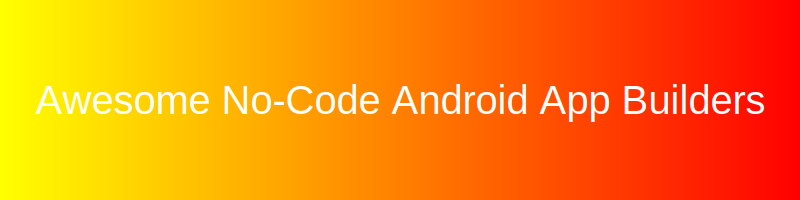

# Awesome-No-Code-Android-App-Builders
## Top No-Code Android App Builders & Open-Source Alternatives

A curated guide to leading **SaaS/cloud-hosted No-Code Android App Builders** (like Adalo, Appy Pie, Thunkable, FlutterFlow, Andromo) and their **open-source/self-hosted equivalents**. 

**Open-source solutions are emphasized** for customization, cost savings, self-hosting, and full code ownership.

---

## SaaS / Cloud-Hosted No-Code Android App Builders

Popular visual development platforms for building native or cross-platform Android apps without writing code.

### Leading Options

| Product | Description | Pricing | Free Tier Limit | Valuation/Revenue |
|---------|-------------|---------|-----------------|-------------------|
| **[FlutterFlow](https://flutterflow.io)** | Visual builder for Flutter-based high-performance apps. | Starts at $30/mo | Core features only, no code export | ~$170M Valuation |
| **[Appy Pie](https://appypie.com)** | AI-assisted no-code app creation for Android/iOS. | Starts at $16/mo | App testing only, no publishing | ~$50M ARR |
| **[Adalo](https://adalo.com)** | Drag-and-drop builder for native mobile apps with database integration. | Starts at $36/mo | 1 published app, limited records | ~$35M Valuation |
| **[Thunkable](https://thunkable.com)** | Visual programming with advanced components and live testing. | Starts at $13/mo | Public projects only, limited downloads | ~$25M Valuation |
| **[Andromo](https://andromo.com)** | Focused on monetized Android apps with templates. | Starts at $8/mo | 14-day free trial, no permanent free tier | ~$5M ARR |

These platforms enable rapid prototyping and deployment with minimal technical expertise.

---

## Open-Source / Self-Hosted Alternatives

Open-source tools provide low-code/no-code experiences or code generation for Android app development with full transparency.

### Featured Projects

- **[NocoDB](https://nocodb.com)**  — Open-source Airtable alternative for backend, integrable with mobile builders.
- **[Appsmith](https://appsmith.com)**  — Self-hosted low-code platform for internal tools that can extend to mobile.
- **[Tooljet](https://tooljet.com)**  — Low-code platforms adaptable for mobile/web apps.
- **[Budibase](https://budibase.com)**  — Low-code platforms adaptable for mobile/web apps.
- **[MIT App Inventor](https://appinventor.mit.edu)** — Visual, block-based development environment for building Android apps. Beginner-friendly and widely used in education.

### Additional Open-Source Tools
- **Flutter** / **React Native** with visual IDE extensions or low-code layers.
- **Kodular** or community forks of App Inventor for enhanced Android building.
- **Open-source code generators** and template repositories for Android.
- Self-hosted low-code platforms like **Appsmith** for internal tools that can extend to mobile.

**Tip**: Start with **MIT App Inventor** for true no-code Android development or use Flutter-based visual tools for production-grade apps.

---

## Comparison

| Aspect              | SaaS Platforms                        | Open-Source / Self-Hosted                  |
|---------------------|---------------------------------------|--------------------------------------------|
| **Cost**            | Subscription plans                    | Free (community or self-hosted)            |
| **Customization**   | Platform limits                       | Export code or full modification           |
| **Data Ownership**  | Vendor hosting                        | Complete control                           |
| **Setup Effort**    | Drag-and-drop quickstart              | Learning curve for advanced features       |
| **Use Case**        | Rapid MVP without coding              | Developers wanting ownership & flexibility |

---

## Getting Started

1. Define app complexity and target features.
2. Begin with **MIT App Inventor** for simple apps.
3. Explore Flutter-based open tools for scalable applications.
4. Self-host backends with tools like NocoDB.
5. Test on emulators and export/publish to Google Play.

## Contributing

Feel free to submit PRs to expand this list with more projects, tools, or comparisons!

**Last updated**: July 2026  
*No-code tools evolve quickly — verify export quality and long-term maintainability.*
